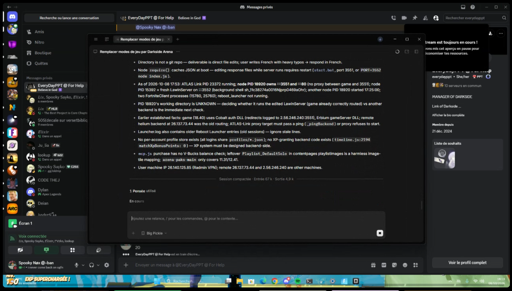

# nox lol

so apparently this guy called nox is a developer now

> [!TIP]
> Don't just take my word for it. Check the screenshots, the code and the information in the repo yourself and make your own opinion.

> [!WARNING]
> Some of the information shown in the screenshots has been redacted.
> Don't use anything in this repository to target, harass, or attack anyone.
i don't really know where to start with this one because the whole thing is genuinely
funny.

basically, nox has a project using a bunch of stuff he clearly didn't write himself,
including code related to erbium, and somehow decided that pushing it to github was a
good idea.

normally i wouldn't care. people use open source code all the time.

the funny part is pretending you made it.

## the code

if you know erbium or have ever looked at projects around it, you probably won't need
much explanation.

a lot of this looks extremely familiar.

same ideas, same structure, same kind of implementation, except now it's apparently
"nox's project".

open source is not magic. changing a couple files and putting your name on the repo
doesn't suddenly make the code yours.

and yes, before someone says it:

> "but he changed stuff"

congratulations.

so does everyone who forks a repository.

## then there's zcode

this is probably my favourite part.

whenever something doesn't work, instead of actually figuring out what's happening,
there's always the good old AI solution.

zcode my beloved

paste error

paste code

"fix this"

copy answer

run it

break something else

repeat

at some point you're not really maintaining a project anymore, you're just operating
a very expensive autocomplete.

and honestly, using AI isn't the problem.

using AI while having absolutely no idea what the code is doing, then acting like you
personally engineered the whole thing, is.

## the screenshot

the screenshot basically sums up the situation.

you've got the project, the server stuff, the development environment and all the
usual nonsense happening in one place.

there's also network information visible in the original screenshot.

i'm not putting the actual IP here because there's literally no reason to do that.
if you're reading this to investigate the project, the code and the public commits
are enough.

don't be stupid and don't attack someone's infrastructure.

## what makes this funny

it's not even the fact that the project uses existing code.

it's the confidence.

you can take existing work

change some things

ask an AI to glue the rest together

push it to github

and somehow end up believing nobody is going to notice.

github has commits.

people can read code.

people can compare repositories.

that's kind of the whole point.

## the screenshot

here's the screenshot that started all of this:

yeah.

make of that what you want.

## the VPS

yes, the screenshot also exposes the server information.

I'm not posting the actual IP here because there is literally no reason
to turn a programming drama into a DDoS invitation.

**VPS:** `[2.56.246.240]`

If you actually want to verify anything, look at the code and the public
GitHub history instead.

## anyway

if you found this repo because someone sent it to you, congratulations.

you have now wasted several minutes reading about nox.

i have also wasted several minutes writing this.

so i guess we're even.

if you think the investigation is interesting, star the repo.

not because nox deserves stars.

just because it's funny.

⭐
